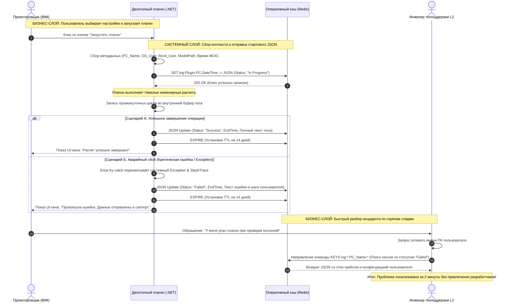

# Business-SystemAnalysis
BSA educative projects

# Кейс: Проектирование системы логирования сессий плагинов для снижения нагрузки на техническую поддержку

>  Данный репозиторий представляет собой кейс, основанный на реальном коммерческом опыте автоматизации процессов и проектирования систем на стыке бизнес- и системного анализа.

---

## 1. Контекст и бизнес-проблема

В компании использовалось десктопное ПО на базе среды Revit для проектирования строительных объектов. Продукт не имел централизованной модели логирования пользовательских сессий. При возникновении критических ошибок у инженеров диагностика выполнялась разработчиками вручную через отладчик на объёмных и тяжелых моделях зданий. Этот процесс занимал от нескольких часов до суток, полностью блокируя работу программистов.

Кроме того, отсутствовала объективная возможность разграничить:
* Внутренние программные сбои продукта (баги кода);
* Ошибки конфигурации со стороны пользователя (некорректные локальные настройки плагинов или геометрии модели).

**Бизнес-цели проекта:**
* Сократить время локализации и диагностики инцидентов техподдержкой с нескольких часов до минут.
* Освободить команду разработки от рутинного разбора первичных тикетов.
* Снизить общую нагрузку на команду технической поддержки (целевой показатель — на 50%).

---

## 2. Бизнес-анализ и оптимизация процессов

### 2.1. Исследование "AS-IS" и моделирование процесса "TO-BE"
Для проектирования решения была проведена серия интервью с ключевыми пользователями (BIM-инженерами, проектировщиками) и сотрудниками техподдержки. Были выявлены следующие **узкие места**:
1. **Проектировщики:** При падении плагина не получали обратной связи от интерфейса. Было непонятно — система зависла, рассчитывает модель или окончательно упала. Это приводило к повторным хаотичным запускам тяжелых операций и усугубляло нагрузку на инфраструктуру.
2. **Техподдержка:** Тратила первую половину дня на сбор контекста инцидента (выяснение имени ПК, версии файла, сбор скриншотов по почте и в мессенджерах).

**Переход к процессу "TO-BE":**
Человеческий фактор при передаче данных об ошибке был полностью исключен. Сбор контекста (метаданных окружения) автоматизирован на уровне самой системы в момент запуска любой операции.

### 2.2. Оптимизация работы команды технической поддержки (L2)
Поскольку внутренний графический интерфейс (дашборд) на данном этапе проекта отсутствовал, ключевой задачей бизнес-анализа было сделать ручной поиск логов в Redis максимально простым, быстрым и не требующим навыков программирования от сотрудников поддержки.

Для этого я перестроила регламент работы саппорта при получении тикета:
1. **Исключение рутины:** Вместо долгого выяснения контекста по телефону, специалист поддержки запрашивает у пользователя только одну строку — сетевое имя его ПК (или имя пользователя).
2. **Поиск по маске:** Благодаря спроектированному дизайну ключей (см. раздел 3.2), инженер поддержки вводит в консоль или клиент Redis команду поиска по маске, например: `KEYS log:*:PC-NAME:*`, и мгновенно получает список всех сессий данного пользователя.
3. **Локализация за 2 минуты:** Специалист сразу видит сессию со статусом `Failed`, открывает её, копирует готовый стек-трейс ошибки из текстового поля `Log` и заводит баг-репорт на разработчиков в Jira.

---

## 3. Системный анализ и технические спецификации

### 3.1. Спецификация контракта данных (JSON Payload)
Для стандартизации обмена данными был спроектирован единый JSON-формат лога. Интеграция и контракты данных валидировались с помощью инструментов тестирования API (Postman/Swagger).

| Поле | Тип данных | Описание |
| :--- | :--- | :--- |
| `startExecutionDateTime` | String | Системное время запуска плагина, приведенное к часовому поясу МСК (ISO 8601) |
| `endExecutionDateTime` | String / null | Время завершения работы плагина (заполняется по окончании процесса) |
| `pcName` | String | Уникальное сетевое имя персонального компьютера пользователя |
| `osUser` | String | Имя пользователя в операционной системе Windows |
| `revitUser` | String | Уникальный ID пользователя внутри среды проектирования Revit |
| `modelPath` | String | Абсолютный путь к файлу активной центральной BIM-модели здания |
| `pluginName` | String | Техническое наименование запущенного плагина |
| `status` | String | Текущий статус выполнения сессии (`In Progress`, `Success`, `Failed`) |
| `log` | String | Текстовое поле, куда пишутся промежуточные шаги и конфигурация пользователя |

**Пример JSON-пакета при инициализации сессии:**
```json
{
  "startExecutionDateTime": "2026-06-05T16:00:00+03:00",
  "endExecutionDateTime": null,
  "pcName": "DESKTOP-BIM-04",
  "osUser": "sagdeeva.e",
  "revitUser": "E.Sagdeeva_Avin",
  "modelPath": "P:\\Projects\\Kazan_Block_A\\Models\\Architecture_r24.rvt",
  "pluginName": "ClashDetectorPro",
  "status": "In Progress",
  "log": "Инициализация плагина. Пользователь выбрал параметры: Этаж 3, Секция Б. Валидация геометрии запущена."
}

```

### 3.2. Архитектура хранения данных в Redis
В качестве оперативного хранилища логов было выбрано NoSQL-решение Redis (Key-Value). Для оптимизации поиска и защиты сервера от переполнения оперативной памяти (падений по `Out of Memory`) внедрены следующие правила:

1. **Дизайн ключей (Key Design):** Ключи формируются по жесткой маске:  
   `log:{PluginName}:{PC_Name}:{StartExecutionDateTime}`  
   Это позволяет техподдержке мгновенно извлекать данные конкретного сотрудника.
2. **Политика управления памятью (TTL):** Для всех записей установлен Time-To-Live (время жизни), равный **14 дням** (`EXPIRE` на 1 209 600 секунд). Этого достаточно для разбора инцидентов по горячим следам, после чего устаревшие логи автоматически удаляются, освобождая RAM сервера.

---

## 4. Жизненный цикл записи (State Machine)

В зависимости от поведения системы, десктопное приложение обновляет существующую запись в Redis по её ключу:

* **Сценарий Успеха (`Success`):** Плагин выполнил задачу без сбоев. Приложение отправляет финальный пакет, меняя статус на `"Success"`, проставляет `endExecutionDateTime`, дописывает в лог финальные метрики расчета и активирует таймер TTL на 14 дней.
* **Сценарий Сбоя (`Failed`):** В коде плагина вылетает необработанное исключение. Блок `try-catch` перехватывает его перед падением процесса, меняя статус в Redis на `"Failed"`, фиксирует время окончания и записывает весь системный стек-трейс (`Exception.Message` и `StackTrace`) в поле `Log` для анализа саппортом.

---

## 5. Визуализация архитектуры взаимодействия (Sequence Diagram)

Ниже представлена диаграмма последовательности, описывающая сквозной процесс взаимодействия пользователя, плагина, базы данных Redis и инженера технической поддержки:


---

## 6. Рефлексия автора и ответы на сложные вопросы (FAQ)

В данном разделе я собрала реальные кейсы, метрики и архитектурные вызовы, с которыми столкнулась в процессе аналитики и защиты данного решения.

### 📊 Как считался бизнес-эффект (Снижение нагрузки на 50%)?
В компании был внедрен строгий регламент тайм-трекинга (учета рабочего времени). На основе внутренней статистики и табелей сотрудников были сделаны замеры до и после внедрения системы:
* **ДО:** Время на ручной дебаг, сбор контекста у пользователя (имя ПК, версия файла, скриншоты) и локализацию ошибки в тяжелой модели занимало **от 5 минут до 2 часов** чистого времени разработчика или инженера поддержки.
* **ПОСЛЕ:** Время локализации инцидента сократилось до **~5 минут**. Ошибка находится по маске ключа в Redis за пару кликов, а саппорт L2 может самостоятельно завести баг-репорт со стек-трейсом без привлечения программистов.

### 🗣️ Работа с «конфликтными» заказчиками и сбор требований
В роли внутренних заказчиков и пользователей выступали руководители BIM-отделов и главные инженеры. В процессе работы регулярно возникали ситуации, когда заказчики забывали первоначальные договоренности или требовали функционал, который не входил в рамки текущего релиза. 

**Мой подход к решению:** Я выстроила процесс через жесткую валидацию требований. При возникновении споров я поднимала утвержденные ТЗ и спецификации, чтобы четко разграничить: была ли нужная функция официально зафиксирована и передана в разработку, либо это был «коридорный диалог» на уровне руководителей, который не был задокументирован. Это позволяло снимать негатив и возвращать обсуждение в конструктивное русло.

### 💾 Технический вызов: Почему Redis и как контролировался объем памяти?
* **Вопрос нагрузки на RAM:** Плагины Revit часто работают долго (по 10–20 минут), но это связано не со сложностью текстовых шагов лога, а с монотонной обработкой огромных массивов данных (коллекций элементов Revit с уникальными ID). Сам текстовый лог шагов оставался компактным и не перегружал оперативную память Redis.
* **Архитектурное разделение:** Если плагин по логике работы требовал формирования детального отчета по *каждому* обработанному элементу, мы не писали это в плоский текст. Для таких задач проектировалась отдельная JSON-структура (связанная с основным логом через `Log_ID`), где на каждый уникальный ID элемента фиксировался свой статус обработки. Это позволило сохранить быстродействие кэша и не столкнуться с проблемой переполнения памяти.
